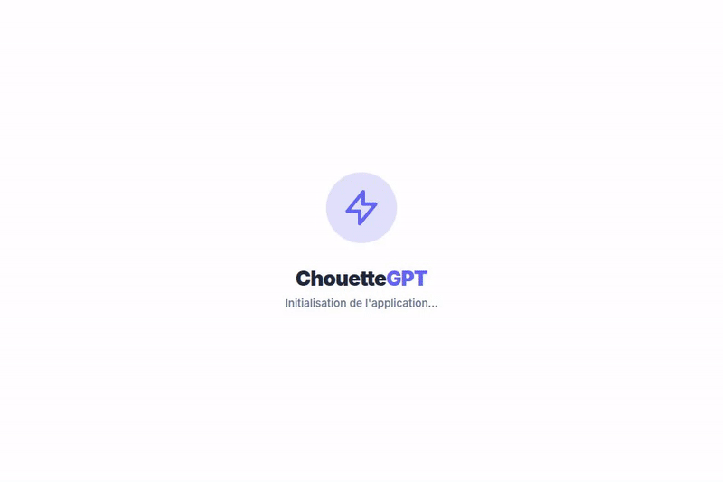

[English](#english) | [Français](#français)

---

# ChouetteGPT

A local AI text generation interface with CPU/GPU support (WebGPU/WebAssembly). Experimental status applies - use at your own risk.

## Features
- Multiple AI models (CPU/GPU)
- Local execution (no data leaves your device)
- WebGPU acceleration for MLC models
- Intuitive UI with tailwind

## Requirements
- Node.js 18+
- Browser with WebGPU support (or fallback to CPU)

## Setup
1. `npm install`
2. `npm run dev` to start dev server
3. Access at http://localhost:3000

## Project Direction
- **[Project Goals](./GOAL.md)**: Read about the core philosophy, mission, and architectural goals of Chouette GPT.
- **[Technical Roadmap](./ROADMAP.md)**: Explore the planned evolutionary phases (Vision, Tools, specialized tasks).
- **[100-Step Commercial & Revenue Roadmap](./COMMERCIAL_ROADMAP.md)**: Explore the step-by-step master strategy from product packaging to market launch, B2B sales, and monetization.

## Contributing
See CONTRIBUTING.md for guidelines

## Sponsor the Mission
ChouetteGPT is an open-source project. If you are a company using this tool or a developer who believes in our mission of making private AI accessible to everyone, please consider supporting us.
👉 **[Support ChouetteGPT & Consulting](./SPONSORS.md)**

## License
This project is licensed under the **Apache License 2.0** - see the [LICENSE](LICENSE) file for details.

 

---

# ChouetteGPT

Une interface locale de génération de texte par IA avec support CPU/GPU (WebGPU/WebAssembly). Statut expérimental - à utiliser à vos propres risques.

## Fonctionnalités
- Modèles IA multiples (CPU/GPU)
- Exécution locale (aucune donnée ne quitte votre appareil)
- Accélération WebGPU pour les modèles MLC
- Interface utilisateur intuitive avec Tailwind

## Prérequis
- Node.js 18+
- Un navigateur supportant WebGPU (ou repli sur le CPU)

## Installation
1. `npm install`
2. `npm run dev` pour lancer le serveur de développement
3. Accédez à http://localhost:3000

## Orientation du projet
- **[Objectifs du Projet](./GOAL.md)** : En savoir plus sur la philosophie centrale, la mission et les objectifs d'architecture de Chouette GPT.
- **[Feuille de Route Technique](./ROADMAP.md)** : Explorer les phases d'évolution planifiées (Vision, Outils, tâches spécialisées).
- **[Plan Commercial & Revenus en 100 Étapes](./COMMERCIAL_ROADMAP.md)** : Explorer la stratégie complète de la finalisation produit à la commercialisation B2B et la monétisation.

## Contribuer
Voir CONTRIBUTING.md pour les directives.

## Soutenir la Mission
ChouetteGPT est un projet open-source. Si vous êtes une entreprise utilisant cet outil ou un développeur qui croit en notre mission de rendre l'IA privée accessible à tous, pensez à nous soutenir.
👉 **[Soutenir ChouetteGPT & Consulting](./SPONSORS.md)**

## Licence
Ce projet est sous licence **Apache License 2.0** - voir le fichier [LICENSE](LICENSE) pour plus de détails.